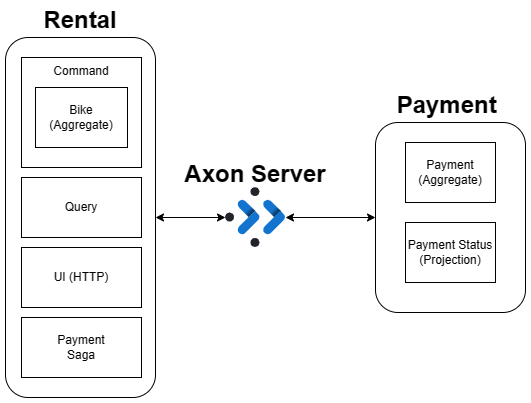
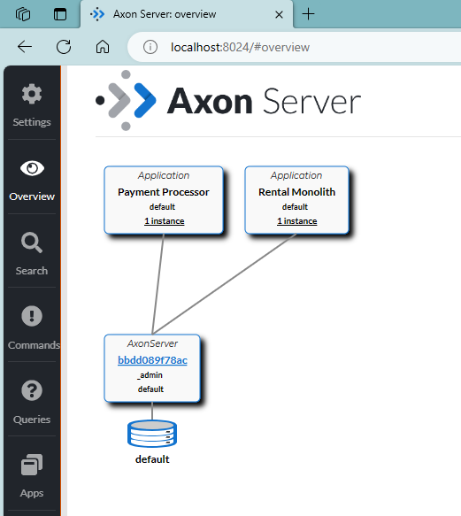

# Building event-driven applications using DDD, CQRS and Event Sourcing, with Axon Framework

The goal of this repo is to show how one can develop a structured monolithic application that can evolve to become a set of microservices
using [Axon Framework and Axon Server](https://developer.axoniq.io/).

This starts as two services, Rental (Monolith) and Payment which work together to run the Axoniq World Wide Bike Rental Service. 
The Rental service manages the inventory and rental status of bikes.  While the Payment service manages payment processing related to 
a bike rental.  



## Pre-requisites

The following software must be installed in your local environment:

* JDK version 21.

* Docker-Compose

## Quick Start

* An IDE such as [Jetbrains IDEA](https://www.jetbrains.com/idea/) is recommended.
### Start Services
Begin by running the RentalApplication and PaymentApplication Services (order of startup does not matter).  
This will start a docker image of Axon-Server using run the docker-compose.yaml file found in the root of the project. 
Once you have both services started you can see them connected to Axon-Server at http://localhost:8024/#overview
.  From this page you are able to
navigate to the details for each application by clicking on the application in the diagram.  From this page you are able
to see the list of connected application instances, handled commands, handled queries, and running event processors

### Populate Inventory of Bikes
In order to begin offering our bike rental service we will need an inventory of bikes.  To do this, navigate to the
[requests.http](./requests.http) file, find the section with the header ```### Generate bikes``` and executing the http 
```POST``` command shown.  This will give you an inventory of bikes which you can verify by executing the http command
found in the```### List all``` section of [requests.http](./requests.http) file.


### Generate Bike Rentals
Now that your inventory is in place it is time to make some money!!  To simulate all the steps of a rental and return 
(request a bike, completing payment, unlocking, and finally returning) we can execute the http command found at the header
```### Generate Rentals``` of the of [requests.http](./requests.http) file.

### 


## Part 2: Evolving monolith to microservices
* Run [create-microservices.sh](create-microservices.sh)

    * To install as a Jar file:

      First, [Download Axon Server](https://developer.axoniq.io/download). In the Axon Server directory, next
      to `AxonServer.jar`, create a file called `axonserver.properties` and add the following lines:

          axoniq.axonserver.devmode.enabled=true
          axoniq.axonserver.standalone=true

      Run Axon Server (@ `localhost:8024`):

          java -jar axonserver.jar

    * To run Axon Server using Docker:

          docker run -d --name axonserver -p 8024:8024 -p 8124:8124 -e AXONIQ_AXONSERVER_DEVMODE_ENABLED=true -e AXONIQ_AXONSERVER_STANDALONE=true axoniq/axonserver

      You can then start and stop Axon Server respectively by running:

          docker start axonserver
          docker stop axonserver

* An IDE such as [Jetbrains IDEA](https://www.jetbrains.com/idea/) is recommended.

## Part 1: Building Rental monolith

The workshop consists of a number of exercises to be completed in sequence, thus building the `rental` app and
connecting its process to the `payment` application, which has already been built.

In this exercise, the command model of the `rental` boundary context will be implemented.

An event-sourced aggregate `Bike` (representing the domain entity "bike") accepts and validates incoming commands,
publishing corresponding events that are persisted in the Axon Server event store.

Follow the steps outlined below.

### Exercise 1 - Creating the Bike aggregate

The (failing) `shouldRegisterBike` test in `BikeTest` attempts to send a `RegisterBikeCommand` to (a newly
created) `Bike` aggregate, expecting
a `BikeRegisteredEvent` to be published as a result.

* Annotate the `Bike` class as an aggregate via `@Aggregate`.

* The aggregate needs a unique identifier; use the `@AggregateIdentifier` annotation on a `String` member field
  called `bikeId`.

* Create a _command handling constructor_, annotated with `CommandHandler`, that accepts `RegisterBikeCommand`; also add
  a no-arg constructor (required).

* Publish a `BikeRegisteredEvent` in the command handling constructor via the statically imported `apply` function.

* Create an _event sourcing handler_ that accepts `BikeRegisteredEvent` and performs the actual state change; in this
  case, setting the aggregate's identifier. An event sourcing handler is a method (choose any name) that is annotated
  with the `@EventSourcingHandler` annotation.

> For more information on implementing aggregates,
> see [here](https://docs.axoniq.io/reference-guide/v/4.6/axon-framework/axon-framework-commands/modeling/aggregate).

Run the test to confirm that you've created the constructor properly.

#### Implementing all Commands and Events

The remaining unit tests cover the other commands and events related to `Bike`.

Implement the required Command Handlers and Event Sourcing handlers to make all the tests pass.

> Note
>
> Unlike in the first exercise, these handlers should act on an existing aggregate instance, rather than creating
> a new one. Therefore, create a regular instance method (the ones with a name and return value) instead of a constructor.
> The best practice is to use `void` as return type, unless you explicitly expect to return a value from the command's
> execution.

Note that the `RequestBikeCommand` expects a return value. This is the "rental reference", which must be a unique
value to be able to refer to a specific attempt to rent a bike. This reference will later be used to link this request
to the payments. You should return the same value that is also used in the `BikeRequestedEvent`.

#### Connecting the Commands to the UI controller

Commands and queries are sent from the `RentalController` using a `CommandGateway` and `QueryGateway` respectively.

Implement the (POST) `/requestBike` and `/returnBike` endpoints by sending the corresponding commands; see
the `generateBikes` method for how to use `CommandGateway`.

### Exercise 2 - Projections

Queries are handled by a query model (a.k.a. _projections_). A projection is updated when events are published, and it
implements so-called _query handlers_ that receive and respond to queries (sent via the `QueryGateway`).

A `BikeStatusProjection` class exists that needs the following:

* Event handlers for each of the events currently supported; an event handler is annotated with `@EventHandler` and
  updates bike statuses in an embedded database.

  > Don't confuse `@EventHandler` with `@EventSourcingHandler`! The latter only exists on the command-side.

  `BikeStatusRepository` offers methods for persisting (`save`) and retrieving instances (`findById`, `findAll`)
  of `BikeStatus`.

  > `BikeStatus` contains methods to set relevant fields; you can find and update a particular bike status via
  >
  >       bikeStatusRepository.findById(someBikeId).ifPresent(
  >        bikeStatus -> { 
  >           // update bikeStatus...
  >        }
  >       )`

* Query handlers are annotated with `@QueryHandler(queryName = "someQuery")` and use `BikeStatusRepository` to retrieve
  and return results (that conform to what is expected in `BikeController`).

In the `RentalController`, implement the (GET) `/bikes` and `/bikes/{bikeId}` endpoints by sending the corresponding
queries:

* GET `/bikes`:

  `queryGateway.query("findAll", null, ResponseTypes.multipleInstancesOf(BikeStatus.class));`

* GET `/bikes/{bikeId}`:

  `queryGateway.query("findOne", bikeId, BikeStatus.class);`

> View
>
the [JavaDoc](https://apidocs.axoniq.io/latest/org/axonframework/queryhandling/QueryGateway.html#query-java.lang.String-Q-org.axonframework.messaging.responsetypes.ResponseType-)
> for sending queries.

#### Running the Application with Axon Server

Open your web browser and navigate to `localhost:8024` for the Administrator UI.

Start the Bike application; you will see the application connected to Axon Server in the _Overview_ section.

Perform the following tasks and inspect the _Search_ (for events), _Commands_ and _Queries_ sections:

The requests to send are available in the `requests.http` file. You may have to change the parameter values for each
request.

* Register a number of bikes.

* Get all registered bikes.

* Request a specific bike.

* Get the status of the requested bike. It should show that it has been requested.

Close the Bike application; reset the event store in the _Settings_ section and remove the `*.db` files that have been
created by H2 in the project's main directory.

### Exercise 3: Connecting the Payment processing

In order to successfully rent a bike, a payment must be made before the bike request is approved. Since this is a
transaction that spans both `rental` and `payment` contexts, a _process_ (also called _saga_) must be initiated.

The payment process is implemented in `PaymentSaga`; it starts and ends upon receiving a `BikeRequestedEvent`
and `PaymentConfirmedEvent` respectively.

Implement the process as follows:

* Annotate a member function that accepts a `BikeRequestedEvent` with

        @StartSaga
        @SagaEventHandler(associationId = "bikeId")

* In this event handler:

  Store the bike ID as process state (simply a member field, which will be used later).

  Generate a new payment ID (for example using `UUID.randomUUID.toString()`) and associated it with the process via:

        SagaLifecycle.associatedWith("paymentId", paymentId)

  Send a `PreparePaymentCommand` via the `CommandGateway`. THe handler for this command is implemented in the Payment
  Application.

* Annotate a member function that accepts a `PaymentConfirmedEvent` with

        @EndSaga
        @SagaEventHandler(associationId = "paymentId")

  Send a `ApproveBikeRequestCommand`.

> Why can't the `@EndSaga` event handler be associated with `bikeId`?

> Why didn't we need a "prepare payment" endpoint in `PaymentController`?

#### Running the Application with Axon Server

> If Axon Server is not currently running, start it again. Make sure to reset the event store.

Start both the `RentalApplication` and the `PaymentApplication`

Perform the following tasks and inspect the _Search_ (for events), _Commands_ and _Queries_ sections:

The requests to send are available in the `requests.http` file. You may have to change the parameter values for each
request.

* Register a number of bikes.

* Get all registered bikes.

* Request a specific bike. Note the rental reference.

* Find the payment ID for the rental reference and confirm that payment.

* Verify that the payment has been approved and the bike is now in use.

* Return the bike in a new location

## Part 2: Scaling out

Our monolith now consists of 4 different components, all within the same application:

* Command component (the `Bike`)
* Query Handlers (the `BikeStatusProjection` and `BikeStatusRepository`)
* Payment coordination (the `PaymentSaga`)
* UI Controller (the `RentalController`)

Let's move each of those classes to their own module. These modules have already been prepared under
the `/microservices` folder in the project.

Move all the classes mentioned above to their respective modules. Note that the package names remain the same. Using
the "move" function of IntelliJ allows you to simply choose a different source root in the dropdown in the lower part of
the "move" window.

Once moved, start each application:

* `RentalCommandApplication`
* `RentalQueryApplication`
* `UserInterfaceApplication`
* `RentalPaymentSagaApplication`
* `PaymentApplication`

Check the Axon Server UI to make sure all applications are started.

Go through the rental process again to validate that everything still works.

Try starting a few extra instances of the microservices. Note that the `UserInterfaceApplication` binds to port 8080, so
you can only start one instance. Check the `Commands` and `Queries` screens on the Axon Server UI to see how commands
and queries are balanced between nodes.

## When you're done

Congratulations! You've implemented the core concepts. But there is a lot more to explore. In these labs, we've
only covered the basics of the functional components of Axon Framework. There are a lot of non-functional configuration
items hidden in this application.

You can take a look at the [Bike Rental Demo application](https://github.com/abuijze/bike-rental-extended) on GitHub fur
the full implementation, including deadlines and subscription queries.